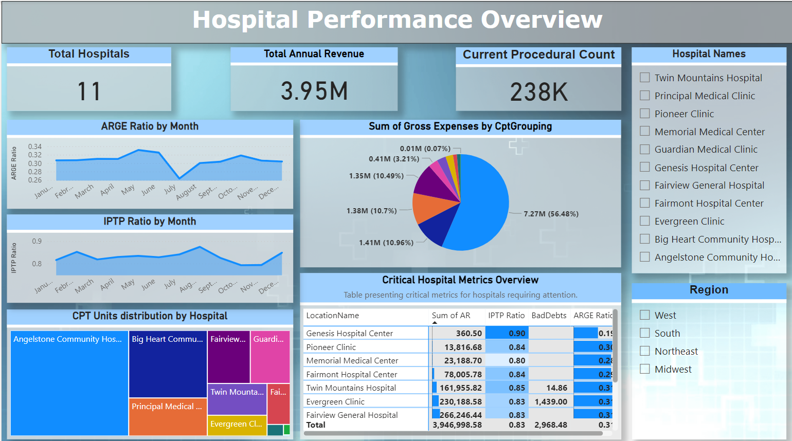
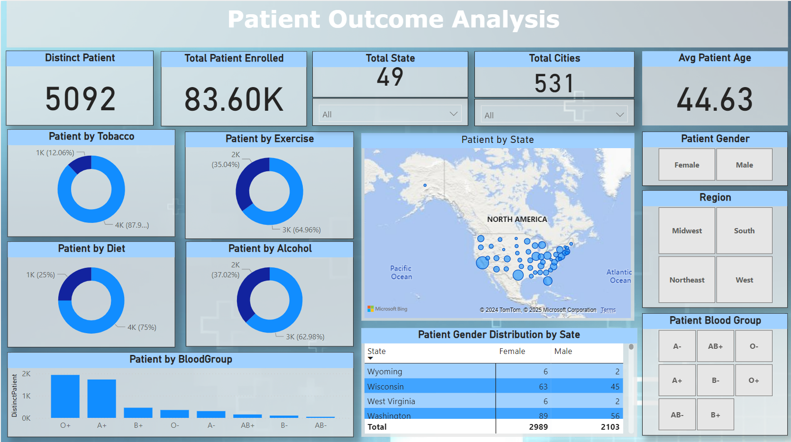

# Hospital Dataset Analysis

This repository contains a project focused on analyzing hospital datasets to track key metrics and performance indicators. The project involves creating various dashboards and reports to visualize and interact with the data.

# Data Tables Used

| **Table Name**      | **Description**                                                                                                                                                      |
|---------------------|----------------------------------------------------------------------------------------------------------------------------------------------------------------------|
| **Fact Table**      | The core transactional data table, linking various dimensions (patient, physician, date, CPT code, payer, transaction, location) to track charges, payments, adjustments, and AR. |
| **dimPatient**      | Stores detailed demographic and health-related information about patients, such as age, gender, health behaviors, and location.                                      |
| **dimPhysician**    | Contains information about physicians, including their names, specialties, and professional details such as their full-time equivalent (FTE) and provider number (NPI). |
| **dimTransaction**  | Captures details of financial transactions in the hospital system, including charges, payments, and adjustments.                                                     |
| **dimSpeciality**   | Provides data on the medical specialties of physicians, categorizing them by code, type, and description.                                                             |
| **dimPayer**        | Contains information about the payers (insurance companies or other entities) responsible for covering medical service costs.                                         |
| **dimLocation**     | Stores data about the locations where medical services are rendered within the hospitals, linked to specific services provided.                                        |
| **dimDiagnosisCode**| Includes codes and descriptions related to patient diagnoses, helping identify and categorize reasons for visits and treatments.                                     |
| **dimCptCode**      | Contains Current Procedural Terminology (CPT) codes used to classify medical procedures and services performed on patients.                                           |
| **dimDate**         | Holds date-related information for transactions and services, including day, month, year, and weekday names, for time-based analysis.                                   |

## Dashboard Overview

### Current Dashboard Metrics
- **Total Hospitals**: 11 hospitals in the dataset.
- **Total Annual Revenue**: 3.95M.
- **Current Procedural Count**: 238K procedures performed.
- **Gross Expenses by CPT Grouping**: Visualized as a pie chart showing the distribution of expenses across different CPT codes.
- **Critical Hospital Metrics Overview**: A table displaying hospital-specific metrics such as ARGE ratio, IPT ratio, and provider specialties.

# Patient Outcome Analysis Dashboard
- **Distinct Patients**: 5,092  
- **Total Patients Enrolled**: 83.60K  
- **Average Patient Age**: 44.63 years  
- **Covered States**: 49  
- **Total Cities**: 531  

### Key Insights:
- **Lifestyle Factors**:  
  - Tobacco users: 12.06%  
  - Alcohol consumers: 37.02%  
  - Regular exercise: 35.04%  
  - Healthy diet: 25%  
- **Gender Distribution**: Female (2,989), Male (2,103)  
- **Top Blood Group**: O+

### Visuals:
- Map showing patient distribution by state.  
- Charts summarizing key metrics like tobacco, diet, alcohol use, and exercise.  

### Achievable Dashboards
- **Physician Performance Dashboard**: Tracking physician metrics like specialties, provider FTE, and ARGE ratio.
- **Transaction and Revenue Dashboard**: Analyzing payments, adjustments, and outstanding AR across hospitals.
- **CPT Code Analysis Dashboard**: Visualizing the frequency and cost distribution of different CPT codes used across hospitals.
- **Regional Performance Dashboard**: Tracking hospital performance and revenue by region, including visualizations of the geographical spread of hospitals.
